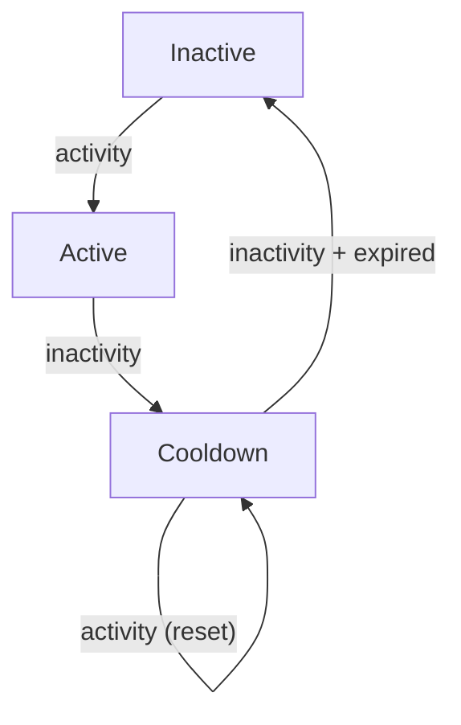

# Global activity state machine

```mermaid
flowchart TD;
    Inactive -- activity --> Active
    Active -- inactivity --> Cooldown
    Cooldown -- inactivity + expired --> Inactive
    Cooldown -- activity (reset) --> Cooldown
```
