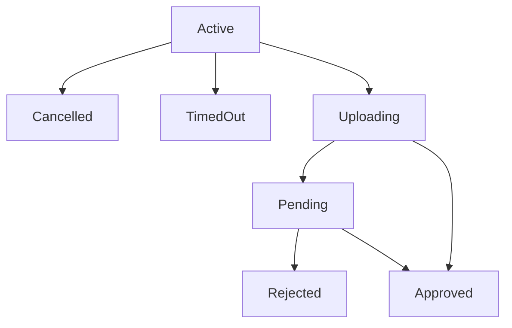

# Attempt states

```mermaid
flowchart TD;
    Active --> Cancelled
    Active --> TimedOut
    Active --> Uploading
    Uploading --> Pending
    Pending --> Rejected
    Pending --> Approved
    Uploading --> Approved
```

## User activity

Player is considered active when:
- Active
- Uploading
- Pending

## Round allocation

Round is allocated for each:
- Active
- Uploading
- Pending
- Approved
