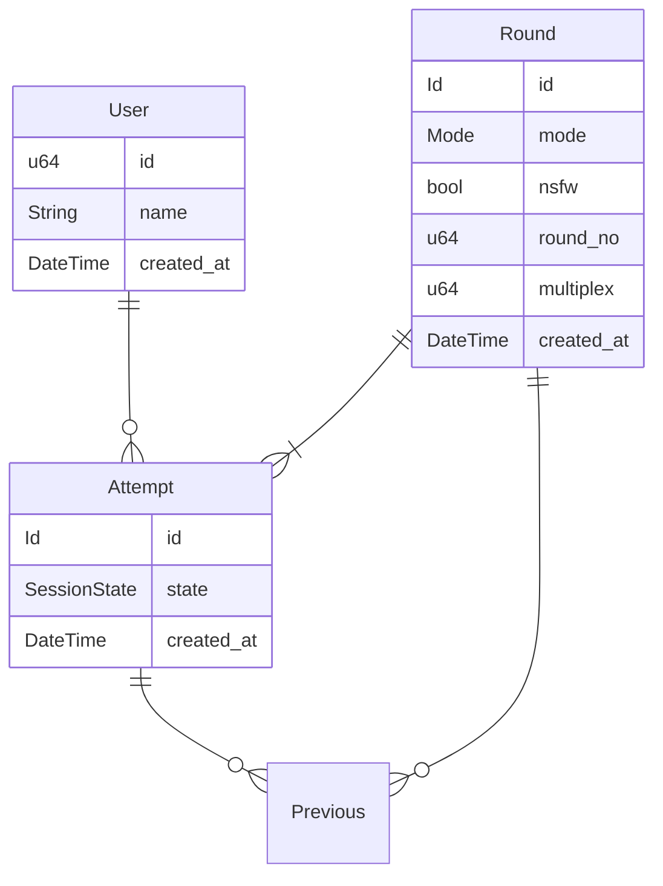

# Database layout

```mermaid
erDiagram
    User ||--o{ Attempt: ""
    Attempt ||--o{ Previous: ""
    Round ||--|{ Attempt: ""
    Round ||--o{ Previous: ""

    User {
        u64 id
        String name
        DateTime created_at
    }
    Attempt {
        Id id
        SessionState state
        DateTime created_at
    }
    Previous {}
    Round {
        Id id
        Mode mode
        bool nsfw
        u64 round_no
        u64 multiplex
        DateTime created_at
    }
```
