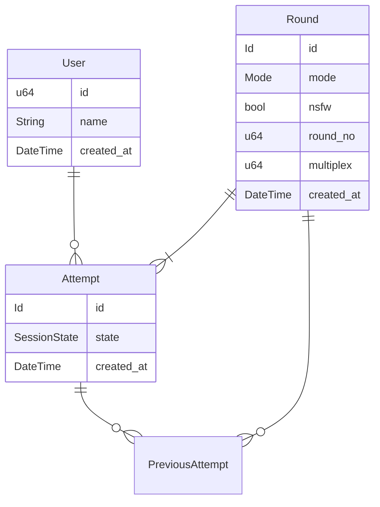
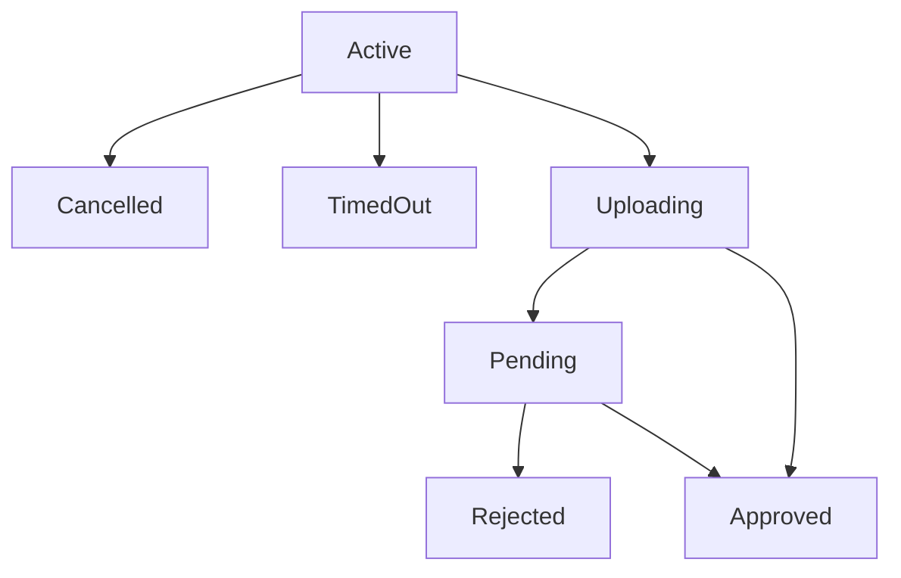

# Definitions

## Allocated round
A round is allocated once per each session that is approved or can lead to approval.
The limit of allocations per round is dictated by the `multiplex` field.

## User previously participated
User has previously participated in a round if he is listed in previous sessions.

## User participated
User has participated in a round if one of his sessions is currently allocating said round.

# Database layout

# Session state

# Complex sequences:

## Upsert player

1. Try update player name
2. If failed, create player

## Play from round N = 0

1. Try to allocate one unallocated round 0
2. If failed, create a pre-allocated round 0

## Play from round N > 0

User cannot play the exact same round twice, but if necessary, they can participate in a round they were in previously.

1. Try find first complete round N without currently approved attempt, ordered by least previous approved attempts, then by random.
2. If failed, no further rounds available.

## Complete round

1. Set attempt as accepted.
2.1. Clone round, update date, incremet round, set multiplex from round logic.
2.2. Attach previous attempts.
2.3. Add new previous attempt.
